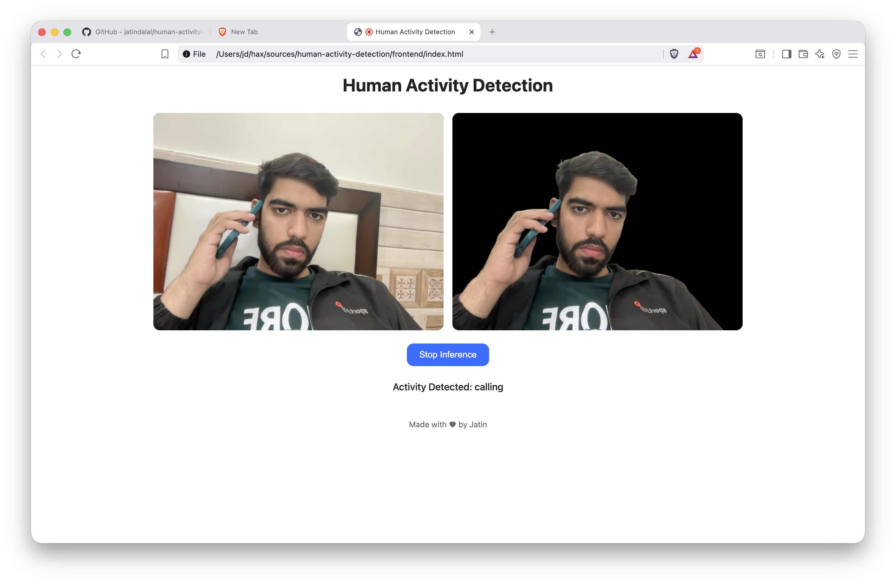

# Human-Activity-Detection

A python application, API, Web Application to detect human activity using transformers

## Setup
```shell
# since pytorch is installed differently on different platforms visit https://pytorch.org/get-started/locally/
# to install it (torch and torchvision) packages are required

pip install fastapi numpy opencv-python transformers \ 
    python-multipart transformers gunicorn uvicorn

```

## Run the application
### API
```bash
cd backend
uvicorn app:app --reload --port 5000
```

### Python script
```bash
python3 activity-detection-webcam.py
```

### Frontend
Requires backend running on port 5000, just use index.html

## Screenshot

