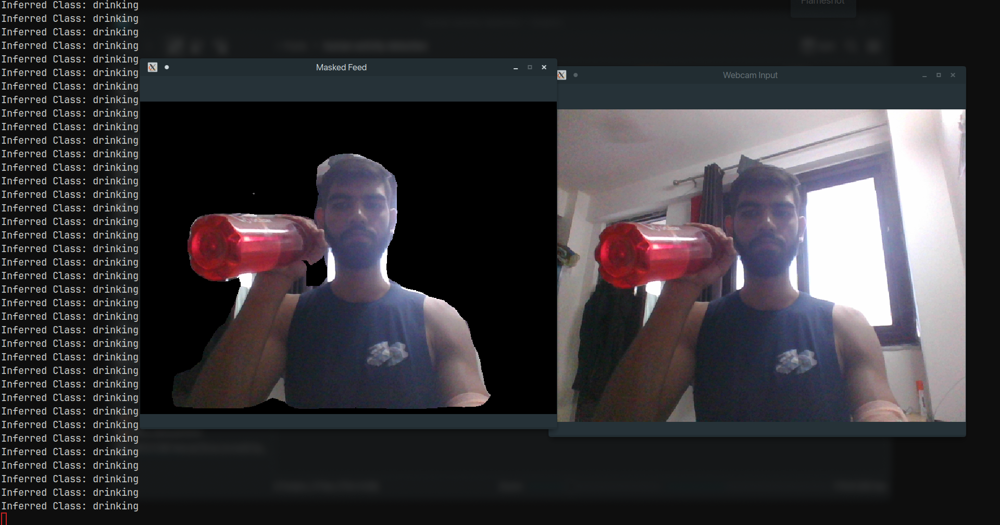

# Human-Activity-Detection

A python application, API, Web Application to detect human activity using transformers

## Setup
```shell
pip install -r requirements.txt

```

## Run the application
### API
```bash
cd backend
uvicorn main.app:app --reload --port 8000
```

### Python script
```bash
python3 main.py
```

### Frontend
Open up `frontend/index.html`, the backend api should be running at port 8000

## Screenshot

